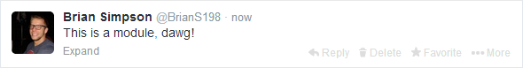

# BEM
* "Block, Element, Modifier "
* Created by Yandex.
* Toolkit [(Available here.)](https://github.com/bem/)
* There's a LOT available, but we'll be just talking about naming conventions from BEM.

--
# Basics
All rules under BEM follow this convention.
~~~css
.block {}           /* A component or something similar. */
.block__element {}  /* A descendant of the block that helps form the block itself. */
.block--modifier {} /* A different state or version of the attached block. */
~~~
Ergo, '__' is linked to an element and '--' is linked to a modifier.

--
# Better Example
~~~css
.tweet {}           /* Block */
.tweet__avatar {}   /* Element */
.tweet__name {}     /* Element */
.tweet__option {}   /* Element */
.tweet--visible {}  /* Modifier */
~~~

--
# Why double characters?
~~~css
/* Why this: */
.tweet--visible{}
/* Instead of this: */
.tweet-visible{}
/* Because of this: */
.tweet-box-visible{}
~~~
The alleged reason is because you can have hyphen delimited block names and a single
character for elements or modifiers would not be enough to distinguish them apart.

--
# That's It
That's really it.  Bear in mind however that BEM can get pretty ugly if you
get a lot of sub-blocks.  Example:
~~~html

	

		

			<!-- Foo -->
		

	

~~~

--
# Small price to pay
However, it's a small price to pay for a more guaranteed way to keep down specificity issues.

	

		
		<h2 class="fragment shootright" data-fragment-index="1">JIM NO LIKE UGLY</h2>
	

	

		
		<h2 class="fragment shootleft" data-fragment-index="2">*BUT JIM LIKE ORGANIZED THING</h2>
	

	*Despite the typography of the font being all caps, the actual content was put in all caps to
	demonstrate Jim's neanderthal language in the best way possible.

