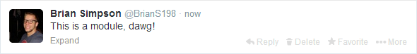

# SMACSS
* "Scalable and Modular Architecture for CSS"
* Created by Jonathan Snook.
* Info [(Available here.)](http://smacss.com/)
* Methodology

--
# Categorization
* Base
 * body, a, a:hover
* Layout
 * header, footer, article, widget
* Module
 * button, box
* State
 * is-hidden, is-active
* Theme (More attributes than core)
 * border, color, background

--
# Base
All of your default styles are base rules.
Example:
~~~css
body { background-color: #000; }
a:link, a:visited {
	color: #0F0;
	text-decoration: none;
}
~~~

--
# Layout
These rules are rules that pertain specifically to the layout of your website.

Jonathan purports that traditionally, these layout methods use ID selectors instead of class selectors
because they are typically singular.  Example:
~~~css
#header {
	width: 960px;
	margin: 0 auto;
}
~~~
However, he pushes for classes on minor layout elements or re-useable chunks, like a grid.
He also uses an l- prefix for these minor elements.
~~~css
.l-grid {
	width: 100%;
	/* Clearfix stuff here */
}
.l-col-1.4 { width: 25%; }
[class*='l-col-'] { float: left; }
~~~

--
# Module
Modules are common components of your website like widgets, comment blocks,
media players, etc.  

--
# Module cont.
Similarly to OOCSS, Jonathan suggests you avoid element selectors.
~~~css
/* BAD */
.module > span { color: #FFF; }
/* GOOD */
.comment { color #FFF; }
~~~

If you use selectors with basic elements, you don't know what may be added or 
removed from future editions of your website, so these rules may become
obsolete with future additions.

This also allows you to use the '.comment' class outside of the module!

--
# Module cont.
This idea also follows with sub-modules. (e.g. Instead of a general media object,
you're styling for the box in a sidebar perhaps.)
~~~css
/* BAD */
#sidebar .module { width: 33%; }
/* GOOD */
.module-side { width: 33%; }
~~~

--
# State
"A state is something that augments and overrides all other styles."
This may be a hidden class, a collapsed class, etc.

These are similar to submodules, but it differs in that they are applied as opposed to stand-alone.
Also, state styles also indicate a Javascript dependency.

--
# Example
~~~css
.accordion {
	height: 200px;
	list-style-type: none;
}
.is-accordion-collapsed { display: none; }
~~~

--
# Theme
These are styles that pertain to a theme.  This may not apply to every website, but if you had 
the potential for multiple themes, it would be advantageous to separate theme attributes like
colors or images.
~~~css
/* Inside of module-name.css */
.comment { border: 1px solid; }
/* Inside of theme-name.css */
.comment { border-color: #FFF; }
~~~

--
# SMACSS

	

		

			There's more to SMACSS than just these five tenants such as selector performance
			or how nested your CSS rules should go; however, that's beyond the scope of the presentation.
		

	

	

		
		<h2 class="fragment shootleft h1-orange" data-fragment-index="1">JIM STAMP OF APPROVAL</h2>
	

If you're interested, please check out [http://smacss.com/](http://smacss.com/) !